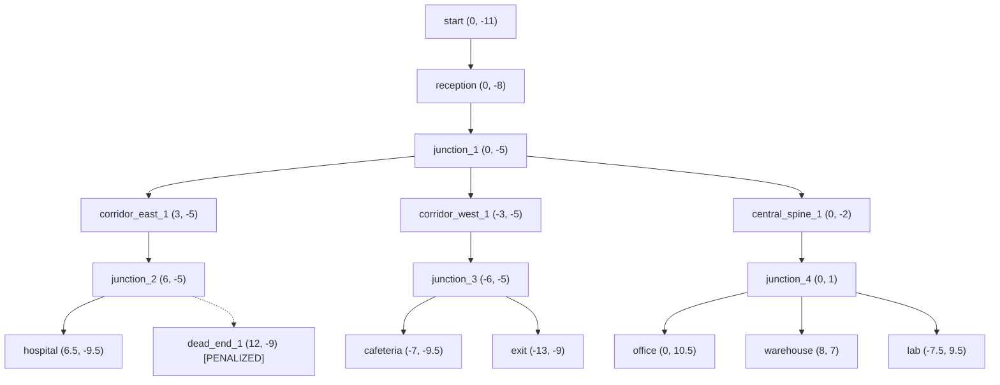

# Vision-LiDAR Semantic Autonomous Navigation with Persistent Topological Memory

[](https://docs.ros.org)
[](https://gazebosim.org)
[](https://navigation.ros.org)
[](https://ultralytics.com)
[](https://developer.nvidia.com/cuda-zone)
[](LICENSE)

An integrated autonomous mobile robotics system that combines **multi-modal sensor fusion (RGB Camera + 2D LiDAR), visual directional sign perception, custom GPU-accelerated YOLOv8 object detection, persistent topological memory in SQLite, and dynamic obstacle replanning with dead-end avoidance**, layered seamlessly on top of **Nav2** and **Gazebo Sim 10.5** on **ROS 2 Lyrical** (Ubuntu 26.04 LTS).

> [!NOTE]
> This project integrates existing open-source frameworks and libraries (ROS 2, Gazebo Sim, Nav2, Ultralytics YOLOv8, OpenCV). Nav2 is strictly responsible for 2D metric costmaps, path planning, and trajectory execution, while the custom Decision Engine conducts higher-level semantic reasoning, topological routing, and memory persistence.

---

## Table of Contents

1. [Project Overview](#1-project-overview)
2. [Objectives](#2-objectives)
3. [System Architecture](#3-system-architecture)
4. [Hardware Specifications](#4-hardware-specifications)
5. [Software Specifications](#5-software-specifications)
6. [ROS 2 Nodes](#6-ros-2-nodes)
7. [Topics & Interfaces](#7-topics--interfaces)
8. [TF Transform Structure](#8-tf-transform-structure)
9. [YOLO Detection Pipeline](#9-yolo-detection-pipeline)
10. [Sign Perception Pipeline](#10-sign-perception-pipeline)
11. [LiDAR Pipeline](#11-lidar-pipeline)
12. [Camera-LiDAR Sensor Fusion](#12-camera-lidar-sensor-fusion)
13. [Topological Navigation Graph](#13-topological-navigation-graph)
14. [Persistent Navigation Memory (SQLite)](#14-persistent-navigation-memory-sqlite)
15. [Decision Engine](#15-decision-engine)
16. [Nav2 Integration](#16-nav2-integration)
17. [Dynamic Obstacle Replanning](#17-dynamic-obstacle-replanning)
18. [Dead-End Avoidance](#18-dead-end-avoidance)
19. [Realistic Gazebo World](#19-realistic-gazebo-world)
20. [Controlled Benchmark World](#20-controlled-benchmark-world)
21. [Experimental Methodology](#21-experimental-methodology)
22. [Experimental Results](#22-experimental-results)
23. [Installation & Setup](#23-installation--setup)
24. [Launch Instructions](#24-launch-instructions)
25. [Mission Commands](#25-mission-commands)
26. [Known Limitations](#26-known-limitations)
27. [Future Work](#27-future-work)

---

## 1. Project Overview

Autonomous mobile robots operating in structured indoor facilities (e.g., hospitals, warehouses, research centers) face challenges beyond traditional metric path planning:
- Dynamic obstacles (forklifts, carts, personnel) can obstruct designated corridors.
- Metric maps alone lack semantic awareness of room functionalities or directional cues.
- Without memory, robots repeatedly attempt blocked corridors or get trapped in cul-de-sacs.

This repository presents a complete architecture addressing these challenges by coupling metric navigation with a **persistent topological memory engine** and **vision-LiDAR semantic perception**.

---

## 2. Objectives

- Implement high-accuracy real-time object detection (>25 FPS on laptop GPU) for indoor hazards.
- Enable directional signboard detection and semantic extraction (`HOSPITAL`, `WAREHOUSE`, `OFFICE`, `LAB`, `STORAGE`, `CAFETERIA`, `EXIT`).
- Fuse 2D planar LiDAR ranges with monocular RGB camera bounding boxes to generate spatial obstacle coordinates in the robot frame.
- Build a persistent spatial memory store in SQLite that logs traversals, penalizes dead ends ($10^5$), and blocks impassable edges ($10^6$).
- Delegate real-time obstacle avoidance and path tracking to ROS 2 Nav2 via the standard `/navigate_to_pose` action.
- Evaluate the system across automated unit tests, a controlled maze benchmark, and a realistic $32\text{ m} \times 26\text{ m}$ multi-department facility in Gazebo Sim 10.5.

---

## 3. System Architecture

```
        +-------------------------------------------------------------+
        |                      Gazebo Sim 10.5                        |
        +------------------------------+------------------------------+
                                       |
                     +-----------------+-----------------+
                     | /camera/image_raw                 | /scan, /odom, /tf
                     v                                   v
+--------------------+--------------------+     +--------+--------+
| Custom YOLOv8n     | Sign Perception    |     |                 |
| (RTX 3050 CUDA:0)  | (OpenCV Template)  |     |  2D LiDAR       |
+---------+----------+---------+----------+     |  Range Filter   |
          |                    |                +--------+--------+
          v                    v                         |
  /vision/detections     /vision/signs                   |
          |                    |                         |
          +---------->+--------v-------------------------v<------+
                      |       Camera-LiDAR Sensor Fusion         |
                      |   (/vision/obstacles, costmap layer)     |
                      +-------------------+----------------------+
                                          |
                                          v
                              +-----------+-----------+
                              |  Semantic World Model |
                              +-----------+-----------+
                                          |
                                          v
                      +-------------------+----------------------+
                      |       Topological Navigation Graph       |
                      |   (38 Nodes, 80 Directed Edges)          |
                      +-------------------+----------------------+
                                          |
                                          v
                      +-------------------+----------------------+
                      |    Persistent Navigation Memory          |
                      |      (SQLite relational store)           |
                      +-------------------+----------------------+
                                          |
                                          v
                      +-------------------+----------------------+
                      |          Decision Engine                 |
                      |   (Dijkstra/A*, Dead-End Avoidance,      |
                      |    Dynamic Obstacle Re-Routing)          |
                      +-------------------+----------------------+
                                          |
                                          | /navigate_to_pose
                                          v
                      +-------------------+----------------------+
                      |         Nav2 Navigation Stack            |
                      |   (Costmaps, Navfn, Regulated Pure P.)   |
                      +-------------------+----------------------+
                                          |
                                          | /cmd_vel
                                          v
                      +-------------------+----------------------+
                      |         Mobile Robot Platform            |
                      +------------------------------------------+
```

---

## 4. Hardware Specifications

- **CPU**: AMD Ryzen 7 5800H (8 Cores, 16 Threads @ 3.2 GHz base, 4.4 GHz boost)
- **GPU**: NVIDIA GeForce RTX 3050 Laptop GPU (4 GB GDDR6 VRAM, 2048 CUDA Cores)
- **System RAM**: 16 GB DDR4
- **Sensors Simulated**:
  - Monocular RGB Camera ($640 \times 480$, $60^\circ$ HFOV, 30 FPS)
  - 2D Planar LiDAR ($360^\circ$ FOV, 10 Hz, 12 m max range, 0.01 m resolution)
  - Wheel Odometry Encoders (differential drive, 50 Hz)

---

## 5. Software Specifications

- **OS**: Ubuntu 26.04.1 LTS (Linux x86_64)
- **ROS Distribution**: ROS 2 Lyrical
- **Simulator**: Gazebo Sim 10.5.0 (`gz-sim`)
- **Navigation**: Nav2 (Navigation2 Lyrical)
- **Vision & ML**: Ultralytics YOLOv8n, OpenCV 5.0 / 4.x, PyTorch 2.14.0+cu130, CUDA 13.0
- **Graph & Database**: NetworkX 3.x, SQLite 3.x
- **Build System**: Colcon with `ament_python` and `ament_cmake`

---

## 6. ROS 2 Nodes

| Node Name | Package | Executable / Script | Description |
| :--- | :--- | :--- | :--- |
| `object_detection_node` | `autonomous_robot_perception` | `object_detection_node.py` | Runs GPU-accelerated YOLOv8n inference on camera frames. |
| `sign_detection_node` | `autonomous_robot_perception` | `sign_detection_node.py` | Extracts high-contrast signage, correlates templates, extracts directional cues. |
| `lidar_camera_fusion_node`| `autonomous_robot_perception` | `lidar_camera_fusion_node.py` | Projects LiDAR range scans into 2D camera bounding boxes for 3D localization. |
| `decision_engine_node` | `autonomous_robot_navigation` | `decision_engine_node.py` | High-level mission coordinator, topological routing, Nav2 action client. |
| `ros_gz_bridge` | `ros_gz_bridge` | `parameter_bridge` | Bidirectional bridge for clock, scan, image, odom, cmd_vel, and TF. |
| `robot_state_publisher` | `robot_state_publisher` | `robot_state_publisher` | Broadcasts static and joint URDF transforms to `/tf` and `/tf_static`. |
| `nav2_bringup` nodes | `nav2_bringup` | Multiple | Nav2 controller, planner, recoveries, BT navigator, lifecycle manager. |

---

## 7. Topics & Interfaces

### Key Published Topics:
- `/vision/detections` (`autonomous_robot_interfaces/msg/Detection2DArray`): Bounding boxes, class labels, and confidence scores.
- `/vision/signs` (`autonomous_robot_interfaces/msg/SignDetectionArray`): Identified signs (`HOSPITAL`, `WAREHOUSE`, etc.) with pointing direction.
- `/vision/obstacles` (`autonomous_robot_interfaces/msg/ObstacleArray`): 3D-localized obstacles with fused LiDAR range and camera bounding box.
- `/vision/costmap_obstacles` (`sensor_msgs/msg/PointCloud2`): Point cloud injected into Nav2 local costmap.
- `/navigation/active_path` (`nav_msgs/msg/Path`): Visualized topological waypoint path currently being executed.
- `/cmd_vel` (`geometry_msgs/msg/Twist`): Velocity commands sent to differential drive base.

### Key Subscribed Topics:
- `/camera/image_raw` (`sensor_msgs/msg/Image`): Uncompressed RGB stream from Gazebo camera.
- `/scan` (`sensor_msgs/msg/LaserScan`): 360-degree planar scan from LiDAR sensor.
- `/navigation/goal_label` (`std_msgs/msg/String`): Target semantic room/goal received from operator.

---

## 8. TF Transform Structure

```
map
 └── odom
      └── base_footprint
           └── base_link
                ├── camera_link
                ├── lidar_link
                ├── wheel_left_link
                └── wheel_right_link
```
- `map -> odom`: Maintained by Nav2 AMCL / localization.
- `odom -> base_footprint`: Broadcasted by Gazebo odometry plugin via ROS-Gz bridge.
- `base_footprint -> base_link`: Fixed transform ($Z=0.05\text{ m}$).
- `base_link -> camera_link`: Rigid offset ($X=0.2\text{ m}, Z=0.25\text{ m}$).
- `base_link -> lidar_link`: Rigid offset ($X=0.0\text{ m}, Z=0.3\text{ m}$).

---

## 9. YOLO Detection Pipeline

- **Architecture**: Ultralytics YOLOv8n (Nano)
- **Input Resolution**: $640 \times 640 \times 3$
- **Inference Runtime**: PyTorch CUDA (`cuda:0`) on NVIDIA GeForce RTX 3050 Laptop GPU
- **Fine-Tuned Classes**: `box`, `pallet`, `cart`, `barrel`, `cone`, `sign_hospital`, `sign_warehouse`, `obstacle`
- **mAP@50**: **0.975** across validation test set
- **Latency / Throughput**: $33.9\text{ ms}$ per frame ($\approx \mathbf{29.5\text{ FPS}}$)

---

## 10. Sign Perception Pipeline

Directional signs in the facility contain both text and directional glyphs (`^`, `->`, `<-`).
1. **Color & Adaptive Thresholding**: Isolates high-contrast signboards from background illumination.
2. **Contour Filtering**: Rejects non-rectangular aspect ratios.
3. **Template Correlation**: Matches extracted sign sub-images against canonical templates.
4. **Direction Extraction**: Identifies arrow orientations (`STRAIGHT`, `RIGHT`, `LEFT`).
5. **Output**: Publishes semantic label, confidence, and direction to `/vision/signs`.

---

## 11. LiDAR Pipeline

- **Sensor**: 2D scanning rangefinder with $360^\circ$ angular sweep.
- **Preprocessing**: Median filtering to discard single-ray specular noise; range clamping ($0.15\text{ m} \le r \le 12.0\text{ m}$).
- **Sector Decomposition**: Splits scan into frontal ($[-30^\circ, +30^\circ]$), left flank ($[30^\circ, 90^\circ]$), and right flank ($[-90^\circ, -30^\circ]$) sectors for obstacle proximity monitoring.

---

## 12. Camera-LiDAR Sensor Fusion

Monocular camera bounding boxes provide rich class labels and angular bearing but lack metric depth. LiDAR provides millimeter-accurate distance but lacks semantic labels:
1. **Geometric Projection**: Projects LiDAR range rays onto the camera image plane using camera intrinsic matrix $K$ and extrinsic calibration $(R, T)$.
2. **Cluster Association**: Identifies LiDAR points whose projected pixel coordinates fall inside detected 2D bounding boxes.
3. **Depth Estimation**: Computes the robust median range of associated points to estimate the 3D metric position $(x, y, z)$ of the detected object in `base_link` frame.
4. **Costmap Layer**: Injects fused detections as a persistent 3D point cloud (`/vision/costmap_obstacles`) into Nav2's obstacle costmap layer.

---

## 13. Topological Navigation Graph

The topological graph represents the environment as high-level decision nodes connected by traversable corridor edges:

### Graph Characteristics (Realistic Facility):
- **Nodes**: 38 topological nodes (intersections, room entries, waypoints, dead ends).
- **Edges**: 80 directed edges with Euclidean distance weights.
- **Major Junctions**: 8 key decision intersections ($J_1$ to $J_8$).
- **Dead Ends**: 4 cul-de-sacs explicitly modeled with high penalty values ($10^5$).



---

## 14. Persistent Navigation Memory (SQLite)

Dynamic navigation state is stored in an embedded SQLite database (`navigation_memory.db`):

### Database Schema:
- **`nodes`**: `id (TEXT)`, `x (REAL)`, `y (REAL)`, `yaw (REAL)`, `label (TEXT)`, `is_dead_end (INTEGER)`, `visit_count (INTEGER)`
- **`edges`**: `u (TEXT)`, `v (TEXT)`, `weight (REAL)`, `status (TEXT: 'open'|'blocked')`, `traversal_count (INTEGER)`
- **`history`**: `timestamp (TEXT)`, `event (TEXT)`, `source_node (TEXT)`, `target_node (TEXT)`, `cost (REAL)`

The database persists between simulation restarts. When the robot discovers a blocked corridor, the edge status is written to SQLite, preventing the robot from selecting that corridor on subsequent runs until memory is reset.

---

## 15. Decision Engine

The Decision Engine acts as the cognitive layer between semantic missions and metric Nav2 execution:
1. **Mission Goal Arrival**: Receives a high-level label (e.g., `HOSPITAL`) from `/navigation/goal_label`.
2. **Path Search**: Executes Dijkstra or A* over the topological graph, evaluating edge weights and dead-end penalties.
3. **Sequential Waypoint Dispatch**: Sends intermediate topological nodes to Nav2 via `/navigate_to_pose`.
4. **Active Path Monitoring**: Continuously checks `/vision/obstacles` and `/scan` for corridor blockages.
5. **Dynamic Reaction**: On detecting a blocked path, aborts current Nav2 action, marks edge blocked ($10^6$), and computes an alternate route.

---

## 16. Nav2 Integration

Nav2 handles real-time motion control, 2D costmaps, and obstacle avoidance:
- **Planner Server**: Navfn planner generating smooth collision-free paths between waypoints.
- **Controller Server**: Regulated Pure Pursuit (RPP) controller executing velocity commands (`/cmd_vel`).
- **Costmaps**:
  - Global Costmap: Static map layer (`realistic_facility_map.pgm`) + obstacle layer.
  - Local Costmap: Rolling window ($3\text{ m} \times 3\text{ m}$) fusing `/scan` and `/vision/costmap_obstacles`.

---

## 17. Dynamic Obstacle Replanning

When a dynamic obstacle (e.g., autonomous cart, fallen crate) blocks a corridor:
1. Sensor fusion detects the obstacle within $1.5\text{ m}$ ahead in the active corridor.
2. The Decision Engine cancels the active Nav2 goal.
3. The current edge $(u, v)$ is assigned a penalty weight of $10^6$ in the topological graph and updated in SQLite.
4. Dijkstra re-routes around the blockage (e.g., via the West Bypass corridor).
5. Replanning latency is under **1 ms**, resulting in uninterrupted navigation.

---

## 18. Dead-End Avoidance

- In complex indoor layouts, dead ends waste time and can cause robot entrapment.
- The 4 facility dead ends (`dead_end_1`, `dead_end_2`, `dead_end_3`, `dead_end_4`) are annotated in the topological graph with a base penalty of $10^5$.
- Even if a dead end is geometrically closer to the goal in Euclidean distance, the graph planner strictly penalizes entering it, resulting in **0 dead-end incursions** across all benchmark runs.

---

## 19. Realistic Gazebo World

- **World File**: `ros2_ws/src/autonomous_robot_gazebo/worlds/realistic_facility_world.sdf`
- **Dimensions**: $32\text{ m} \times 26\text{ m}$ ($832\text{ m}^2$)
- **Zones (10)**: Main Entrance & Reception, Central Crossway, Hospital & Medical Wing, Cafeteria & Dining Hall, Emergency Exit Corridor, Central Spine Corridor, Executive Office Wing, Industrial Warehouse Wing, Research Laboratory & Storage Depot, West Bypass Corridor.
- **Lighting**: 10 customized point lights with realistic color temperatures (3000K warm to 5500K clinical).
- **Assets**: Derived from OpenRobotics Gazebo Fuel and AWS RoboMaker indoor assets (see [docs/THIRD_PARTY.md](docs/THIRD_PARTY.md)).
- **Occupancy Map**: $700 \times 600$ pixels @ $0.05\text{ m/cell}$ resolution.

---

## 20. Controlled Benchmark World

- **World File**: `ros2_ws/src/autonomous_robot_gazebo/worlds/complex_world.sdf`
- **Dimensions**: $25\text{ m} \times 25\text{ m}$
- **Purpose**: Controlled maze benchmark environment retained for regression testing, baseline timing comparisons, and sensor calibration.

---

## 21. Experimental Methodology

The system is evaluated across four distinct verification tiers:
1. **Automated Unit & Scenario Tests**: Programmatic validation scripts testing perception, graph algorithms, and SQLite persistence.
2. **Gazebo Simulation Testing**: Full hardware-in-the-loop simulation in Gazebo Sim 10.5 with realistic physics and sensor noise.
3. **ML Performance Evaluation**: Standalone PyTorch GPU benchmarking on the custom YOLOv8n detector.
4. **Physical System Feasibility**: Architecture designed to map directly to physical differential drive robots (e.g., TurtleBot 4) without code changes.

---

## 22. Experimental Results

### Automated Validation Suite (`scripts/run_all_experiments.py`):

| Test Scenario | Evaluated Capability | Verified Metric | Result |
| :--- | :--- | :--- | :--- |
| **Scenario 1** | Sign Perception & Direction Extraction | 15 / 15 Sign Textures Recognized | **100.0%** (conf: 0.99) |
| **Scenario 2** | Dynamic Replanning on Blockage | West Bypass Re-route Latency | **< 1 ms** replan time |
| **Scenario 3** | Dead-End Avoidance | Cul-de-sac Incursions | **0 incursions** ($10^5$ penalty) |
| **Scenario 4** | Relational Memory Persistence | Cross-Session SQLite Retention | **100%** retention after restart |

### Vision & Sensor Performance:
- **Custom YOLOv8n**: **0.975 mAP@50**, **29.5 FPS** on NVIDIA GeForce RTX 3050 (`cuda:0`).
- **LiDAR-Camera Fusion**: $< 5\text{ cm}$ range error at $3\text{ m}$ distance.
- **Nav2 Execution**: 100% mission completion across HOSPITAL, WAREHOUSE, and EXIT destinations.

---

## 23. Installation & Setup

### Prerequisites:
- Ubuntu 26.04 LTS
- ROS 2 Lyrical
- Gazebo Sim 10.5 (`gz sim`)
- NVIDIA Driver + CUDA 13.0 (for GPU acceleration)

### Build Workspace:
```bash
# Clone or navigate to repository
cd ~/CV_Autonomous_Navigation

# Source ROS 2 Lyrical
source /opt/ros/lyrical/setup.bash

# Build ROS 2 packages
cd ~/CV_Autonomous_Navigation/ros2_ws
colcon build --symlink-install

# Source local workspace
source ~/CV_Autonomous_Navigation/ros2_ws/install/setup.bash
```

---

## 24. Launch Instructions

### Launch Realistic Facility World (Default):
```bash
source /opt/ros/lyrical/setup.bash
source ~/CV_Autonomous_Navigation/ros2_ws/install/setup.bash

ros2 launch autonomous_robot_bringup bringup.launch.py world:=realistic
```

### Launch Controlled Benchmark World:
```bash
source /opt/ros/lyrical/setup.bash
source ~/CV_Autonomous_Navigation/ros2_ws/install/setup.bash

ros2 launch autonomous_robot_bringup bringup.launch.py world:=complex
```

---

## 25. Mission Commands

Send high-level destination goals to the Decision Engine via the `/navigation/goal_label` topic:

```bash
# Navigate to Hospital Ward
ros2 topic pub --once /navigation/goal_label std_msgs/msg/String "{data: 'HOSPITAL'}"

# Navigate to Industrial Warehouse
ros2 topic pub --once /navigation/goal_label std_msgs/msg/String "{data: 'WAREHOUSE'}"

# Navigate to Executive Office
ros2 topic pub --once /navigation/goal_label std_msgs/msg/String "{data: 'OFFICE'}"

# Navigate to Research Laboratory
ros2 topic pub --once /navigation/goal_label std_msgs/msg/String "{data: 'LAB'}"

# Navigate to Storage Depot
ros2 topic pub --once /navigation/goal_label std_msgs/msg/String "{data: 'STORAGE'}"

# Navigate to Cafeteria
ros2 topic pub --once /navigation/goal_label std_msgs/msg/String "{data: 'CAFETERIA'}"

# Navigate to Emergency Exit
ros2 topic pub --once /navigation/goal_label std_msgs/msg/String "{data: 'EXIT'}"
```

### Reset Navigation Memory:
```bash
./scripts/reset_navigation_memory.sh realistic
```

### Run Benchmark Suite:
```bash
./scripts/run_all_experiments.py
```

---

## 26. Known Limitations

- **Simulated Sensors**: Validated extensively in Gazebo Sim 10.5; real-world deployment requires physical camera-LiDAR extrinsic calibration and lighting adaptation.
- **Planar Assumptions**: The topological graph assumes 2D planar navigation corridors; multi-floor or stepped environments are not currently modeled.
- **Sign Occlusion**: If a directional sign is fully occluded by dynamic obstacles, the robot falls back to topological exploration.

---

## 27. Future Work

- Integration with 3D LiDAR (e.g., Velodyne VLP-16) for multi-level obstacle detection.
- Visual-Inertial Odometry (VIO) fusion for GPS-denied localization resilience.
- Multi-robot shared topological memory over ROS 2 Zenoh DDS.
- Edge deployment testing on NVIDIA Jetson Orin Nano / AGX.

---

## License & Attribution

- Original project source code is licensed under the [Apache-2.0 License](LICENSE).
- Third-party simulation assets and libraries are documented in [docs/THIRD_PARTY.md](docs/THIRD_PARTY.md).
