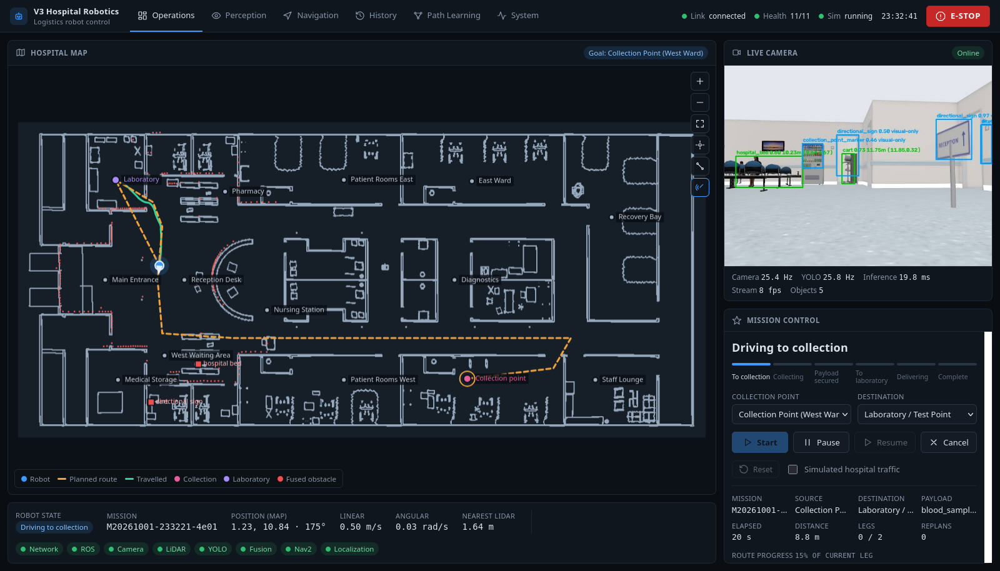

# CV Autonomous Navigation: V3.0 Hospital Logistics Robot

A simulated autonomous hospital logistics robot. It collects a blood-sample carrier at a ward
**collection point** and delivers it to the hospital **laboratory**, driving through a realistic hospital
with staff, visitors and trolleys moving in the corridors.

| | |
|---|---|
| Platform | Ubuntu 26.04 · ROS 2 Lyrical · Gazebo Sim 10.5 · Nav2 · NVIDIA RTX 3050 |
| Environment | AWS RoboMaker Hospital World (MIT-0) + OpenRobotics Gazebo Fuel hospital models (CC-BY 4.0) |
| Perception | YOLOv8n, 9 hospital classes, ~28 Hz on GPU, plus camera–LiDAR spatial fusion |
| Navigation | Nav2 (AMCL, NavFn, Regulated Pure Pursuit) under a topological decision engine with learned route history |
| Operation | Web dashboard on port 8080 (local + LAN) and a desktop launcher |
| Version | **V3.0** (tag `v3.0`) |



## What it does

1. **Mission:** the operator picks a collection point and a destination in the dashboard and presses
   **Start**. The robot then goes through these states: `GO_TO_COLLECTION → AT_COLLECTION → PAYLOAD_SECURED →
   GO_TO_LAB → AT_LAB → MISSION_COMPLETE`.
2. **Navigation:** the decision engine chooses a route through a 33-node topology of the hospital
   (corridors, intersections, doors, rooms), using distance plus learned history (failures, reliability, obstacles,
   familiarity). Nav2 drives each segment on the occupancy map.
3. **Perception:** YOLO detects people, beds, carts, wheelchairs, IV stands, surgical trolleys, signs and the two
   logistics markers. Detections are associated with LiDAR returns to give metric positions. Moving people and
   trolleys trigger yielding (TTC) and replanning.
4. **Safety:** Pause, Resume, Cancel and a latched **emergency stop** (hold at 0 m/s until Reset).

## Quick start

The project must live at `~/CV_Autonomous_Navigation`, because the scripts and the world file use that path.

```bash
git clone git@github.com:daradesoham-cyber/CV_Autonomous_Navigation.git ~/CV_Autonomous_Navigation
cd ~/CV_Autonomous_Navigation
python3 -m venv .venv && .venv/bin/pip install -r requirements.txt     # YOLO, OpenCV, Flask, ...
source /opt/ros/lyrical/setup.bash
cd ros2_ws && colcon build && cd ..
V3/scripts/install_desktop_launchers.sh                                # optional: desktop icons
V3/scripts/start_v3.sh                                                 # or double-click "V3 Hospital Logistics"
```

The system is **READY** after about 30 s. Open **http://localhost:8080**, or the LAN address that the script prints.
To stop: press Enter in the launcher terminal, or run `V3/scripts/stop_v3.sh`.
Options: `--headless` (no Gazebo GUI), `--traffic` (moving staff, visitors and trolley from the start), `--no-browser`, `--port N`.

## Dashboard

| View | Content |
|---|---|
| Operations | Hospital map (zoom/pan, robot, planned and travelled route, locations, LiDAR, fused obstacles), live camera with YOLO boxes, mission control, robot status, E-STOP |
| Perception | Camera, detected-object list (confidence, LiDAR range or *not ranged*), LiDAR/camera association plot |
| Navigation | Current goal and route, decision-engine state, clearances, TTC, route cost terms, event log |
| History | Every stored mission (filter/sort), with route legs, events and the travelled path |
| Path Learning | Per-segment usage, failures, reliability, obstacles and cost, and how they change route choice |
| System | Health of every subsystem (online / starting / error / offline / unavailable), and the live ROS graph |

## Validation (measured, V3.0)

| Test | Result |
|---|---|
| Missions without traffic | 10/10 complete: 289 s and 124 m mean, 0.9 replans mean, min clearance 0.26 m |
| Missions with moving traffic | 5/5 complete: 320 s and 140 m mean, 1.4 replans mean, min clearance 0.18 m |
| Localization vs ground truth (traffic runs) | mean 0.12 m, max 0.37 m |
| System tests (API, controls, safety, LAN, history) | 12/12 |
| Dashboard tests (real browser, real buttons) | 15/15 |
| YOLO in the new hospital | all 9 classes detected, no retraining needed |

Evidence is in `V3/docs/evidence/new_hospital/` and `V3/docs/evidence/ui/`.

## Documentation

| Document | Content |
|---|---|
| [V3/docs/V3.0_DOCUMENTATION.md](V3/docs/V3.0_DOCUMENTATION.md) | Full technical documentation: architecture, nodes and topics, world, map, topology, perception, navigation, mission, dashboard and API, data, rebuilding, testing |
| [V3/V3_FINAL_RUNBOOK.md](V3/V3_FINAL_RUNBOOK.md) | Operator runbook: start, use, stop, health check, troubleshooting |
| [V3/V3_NEW_HOSPITAL_SOURCE.md](V3/V3_NEW_HOSPITAL_SOURCE.md) | Hospital environment source, license and selection |
| [V3/V3_NEW_HOSPITAL_STATUS.md](V3/V3_NEW_HOSPITAL_STATUS.md) | New-hospital integration: fixes made and measured results |
| [V3/V3_COMPLETION_STATUS.md](V3/V3_COMPLETION_STATUS.md) | V3.0 component status |
| [V3/docs/development/](V3/docs/development/) | Development reports (dataset generation, perception, fusion, assets) |

## Repository layout

```
V3/
  worlds/v3_hospital_world.sdf      Gazebo world (generated)
  hospital/models, photos, signs    hospital models and textures (AWS + Fuel + V3 signs)
  maps/v3_hospital_map.*            occupancy map (generated from the collision meshes)
  config/                           Nav2/AMCL parameters, logistics locations, signs
  scripts/                          start/stop/health, world/map/topology builders, layout definition
  models_trained/                   V3 YOLOv8n weights
  perception/, training/, datasets/ fusion library, training and dataset tools
  ui/index.html                     web dashboard
  tests/                            system, mission, UI and perception tests
  docs/                             documentation and evidence
ros2_ws/src/
  hospital_logistics/               V3 nodes: detection, fusion, costmap obstacles, mission manager, traffic, web server
  autonomous_robot_*                robot description, Gazebo bridge, navigation (decision engine, memory), perception, interfaces
config/perception_v25.yaml          perception parameters used by the V3 detection node
```

## Licenses

Project code: Apache 2.0 (`LICENSE`). Hospital building: AWS RoboMaker Hospital World, MIT-0. Furniture and people models:
OpenRobotics on Gazebo Fuel, CC-BY 4.0. See `V3/hospital/models/ATTRIBUTION.md`.
