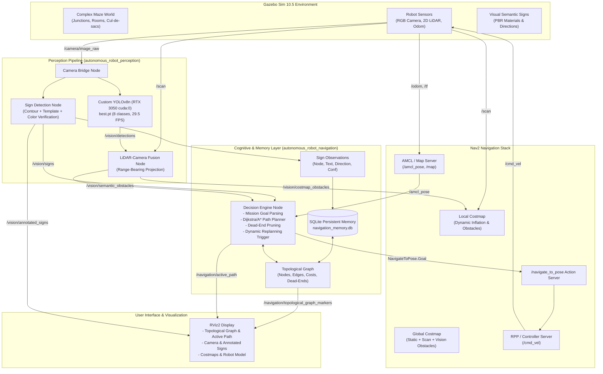

# System Architecture: Semantic Memory-Based Autonomous Navigation

## 1. High-Level Architecture Overview

The system enhances standard 2D mobile robot navigation with **semantic memory, computer vision-based sign interpretation, and topological graph decision-making**, while retaining Nav2 as the sole local and global motion execution authority.

---

## 2. Component Breakdown

### 2.1 Perception Pipeline
- **`sign_detection_node`**:
  - Subscribes: `/camera/image_raw`
  - Detects 15 semantic sign textures using multi-threshold contour extraction, aspect-ratio gating, and normalized cross-correlation template matching.
  - Publishes: `/vision/signs` (`SignDetectionArray`) and `/vision/annotated_signs` (`sensor_msgs/Image`).
- **`object_detection_node`**:
  - Runs custom-trained YOLOv8n weights (`best.pt`) on NVIDIA RTX 3050 (`cuda:0`).
  - Detects 8 classes: `person`, `chair`, `box`, `cone`, `pallet`, `shelf`, `hospital_bed`, `cart`.
  - Achieves 0.975 mAP50 at ~30 FPS.
- **`lidar_camera_fusion_node`**:
  - Fuses bounding boxes with 2D LiDAR scan rays to compute metric 3D obstacle locations.
  - Publishes semantic obstacle array and point cloud costmap obstacle layer.

### 2.2 Cognitive Layer & Memory System
- **`topological_graph.py`**:
  - Encapsulates nodes (junctions, rooms, dead ends) and edges.
  - Computes optimal paths using Dijkstra / A* with penalty weights for dead ends ($10^5$) and blocked edges ($10^6$).
- **`navigation_memory.py`**:
  - SQLite database at `config/navigation_memory.db`.
  - Persists nodes, edges, traversal counts, detected signs, and obstacle blockage history across reboots.
- **`decision_engine_node.py`**:
  - High-level orchestrator.
  - Translates user mission goals (`/navigation/goal_label`) into topological waypoints.
  - Commands Nav2 via `/navigate_to_pose` action client.
  - Reacts to corridor blockages by cancelling Nav2 goal, updating memory, and computing alternate routes (e.g. West Bypass).

### 2.3 Motion Control & Safety
- **Nav2 Stack**:
  - Retains exclusive authority over local trajectory generation and collision avoidance.
  - Dual obstacle layer (`/scan` + `/vision/costmap_obstacles`) ensures both geometry and semantic obstacles are respected.
