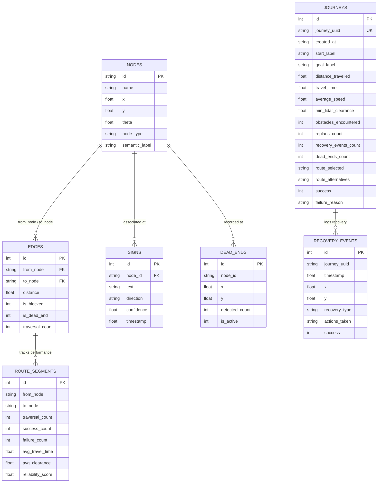

# Database Schema & Persistent Memory Documentation

This document describes the SQLite schema, table relationships, persistent memory mechanisms, and analytics queries for **Autonomous Navigation V2**.

Database location: `ros2_ws/src/autonomous_robot_navigation/config/navigation_memory.db`

---

## 1. Schema Overview

The database stores topological graph structure, semantic visual memory, real-time dynamic obstacle events, historical journeys, route segment reliability statistics, identified dead ends, and recovery event logs.



---

## 2. Table Definitions

### 2.1 `nodes`
Stores the static and semantic waypoints of the facility topological graph.

| Column | Type | Description |
|---|---|---|
| `id` | `TEXT PRIMARY KEY` | Unique node identifier (e.g., `start`, `reception`, `junction_1`, `room_a`) |
| `name` | `TEXT NOT NULL` | Human-readable name (e.g., `Room A Research Suite`) |
| `x` | `REAL NOT NULL` | X coordinate in metric `map` frame (meters) |
| `y` | `REAL NOT NULL` | Y coordinate in metric `map` frame (meters) |
| `theta` | `REAL DEFAULT 0.0` | Target arrival heading in radians |
| `node_type` | `TEXT DEFAULT 'waypoint'` | Classification: `start`, `destination`, `junction`, `waypoint`, `dead_end` |
| `semantic_label` | `TEXT DEFAULT ''` | Sign or room label (e.g., `ROOM A`, `STORAGE`, `CHARGING`) |

### 2.2 `edges`
Directed connectivity and topological corridor edges between nodes.

| Column | Type | Description |
|---|---|---|
| `id` | `INTEGER PRIMARY KEY AUTOINCREMENT` | Unique edge ID |
| `from_node` | `TEXT NOT NULL` | Origin node ID |
| `to_node` | `TEXT NOT NULL` | Destination node ID |
| `distance` | `REAL NOT NULL` | Euclidean corridor distance (meters) |
| `is_blocked` | `INTEGER DEFAULT 0` | Flag (1 if corridor currently obstructed by dynamic/static obstacle) |
| `is_dead_end` | `INTEGER DEFAULT 0` | Flag (1 if corridor leads directly into an impassable dead end) |
| `traversal_count`| `INTEGER DEFAULT 0` | Lifetime successful traversals across this corridor |

### 2.3 `signs`
Observations of visual directional and facility room signs captured by the RGB camera.

| Column | Type | Description |
|---|---|---|
| `id` | `INTEGER PRIMARY KEY AUTOINCREMENT` | Record ID |
| `node_id` | `TEXT NOT NULL` | Nearest topological node when sign was observed |
| `text` | `TEXT NOT NULL` | Text label read from the sign (e.g. `ROOM A`, `EXIT`) |
| `direction` | `TEXT NOT NULL` | Directional indicator (`LEFT`, `RIGHT`, `STRAIGHT`, `AHEAD`) |
| `confidence` | `REAL NOT NULL` | YOLO / OCR perception confidence score [0.0, 1.0] |
| `timestamp` | `REAL NOT NULL` | Unix epoch time of sign observation |

### 2.4 `journeys`
Comprehensive historical mission logs for every navigation trip executed by the robot.

| Column | Type | Description |
|---|---|---|
| `id` | `INTEGER PRIMARY KEY AUTOINCREMENT` | Internal journey sequence ID |
| `journey_uuid` | `TEXT UNIQUE` | Human-readable or UUID journey code (e.g. `J-001`) |
| `created_at` | `TEXT NOT NULL` | ISO / Human readable timestamp (`YYYY-MM-DD HH:MM:SS`) |
| `start_label` | `TEXT NOT NULL` | Origin node or semantic label |
| `goal_label` | `TEXT NOT NULL` | Destination node or semantic label |
| `start_x`, `start_y` | `REAL` | Metric coordinates at mission departure |
| `goal_x`, `goal_y` | `REAL` | Metric coordinates at target destination |
| `path_nodes` | `TEXT` | Ordered comma-separated list of visited topological nodes |
| `path_coordinates`| `TEXT` | Serialized JSON array of continuous (x, y) coordinates |
| `distance_travelled`| `REAL NOT NULL` | Total cumulative odometric distance traveled (meters) |
| `travel_time` | `REAL NOT NULL` | Total journey duration in seconds |
| `average_speed` | `REAL NOT NULL` | Average translation speed ($d / t$) in m/s |
| `min_lidar_clearance`| `REAL NOT NULL` | Minimum distance to obstacles recorded by LiDAR (meters) |
| `obstacles_encountered`| `INTEGER DEFAULT 0` | Dynamic/static obstacles triggering alerts |
| `replans_count` | `INTEGER DEFAULT 0` | Number of route recalculations during journey |
| `recovery_events_count`| `INTEGER DEFAULT 0` | Number of recovery behaviors initiated |
| `dead_ends_count` | `INTEGER DEFAULT 0` | Number of dead ends encountered |
| `route_selected` | `TEXT` | Identifier of selected candidate route |
| `route_alternatives` | `TEXT` | Serialized JSON of evaluated candidate alternative paths |
| `success` | `INTEGER DEFAULT 1` | 1 if destination reached, 0 if aborted/failed |
| `failure_reason` | `TEXT` | Failure diagnosis if applicable |
| `avg_obstacle_density`| `REAL DEFAULT 0.0` | Average obstacle density score along path |

### 2.5 `route_segments`
Granular performance tracking for each individual corridor segment. Used directly by the Multi-Criteria Route Planner.

| Column | Type | Description |
|---|---|---|
| `id` | `INTEGER PRIMARY KEY AUTOINCREMENT` | Record ID |
| `from_node`, `to_node` | `TEXT NOT NULL` | Segment endpoints |
| `traversal_count` | `INTEGER DEFAULT 0` | Total attempted traversals |
| `success_count` | `INTEGER DEFAULT 0` | Number of times traversed without incident |
| `failure_count` | `INTEGER DEFAULT 0` | Number of times blocked or aborted |
| `avg_travel_time` | `REAL DEFAULT 0.0` | Moving average traversal duration (seconds) |
| `avg_clearance` | `REAL DEFAULT 0.5` | Moving average LiDAR obstacle clearance (meters) |
| `obstacle_encounter_count`| `INTEGER DEFAULT 0` | Times dynamic obstacles blocked this segment |
| `replan_count` | `INTEGER DEFAULT 0` | Replans forced on this segment |
| `reliability_score` | `REAL DEFAULT 1.0` | Reliability metric $\in [0.05, 1.0]$ |
| `last_traversed` | `REAL DEFAULT 0.0` | Epoch timestamp of last traversal |

### 2.6 `dead_ends`
Persistent registry of dead-end corridors and alcoves discovered by the robot.

| Column | Type | Description |
|---|---|---|
| `id` | `INTEGER PRIMARY KEY AUTOINCREMENT` | Record ID |
| `node_id` | `TEXT NOT NULL` | Identifier of the dead-end waypoint |
| `x`, `y` | `REAL NOT NULL` | Metric coordinates of the dead end pocket |
| `detected_count` | `INTEGER DEFAULT 1` | Times robot has confirmed this dead end |
| `last_detected` | `REAL NOT NULL` | Timestamp of latest encounter |
| `is_active` | `INTEGER DEFAULT 1` | Active flag (1 = avoid this corridor) |

### 2.7 `recovery_events`
Audit log of all autonomous recovery maneuvers.

| Column | Type | Description |
|---|---|---|
| `id` | `INTEGER PRIMARY KEY AUTOINCREMENT` | Record ID |
| `journey_uuid` | `TEXT` | Associated journey identifier |
| `timestamp` | `REAL NOT NULL` | Timestamp of trigger |
| `x`, `y` | `REAL NOT NULL` | Robot coordinates when recovery triggered |
| `recovery_type` | `TEXT NOT NULL` | Trigger cause: `STUCK_NO_PROGRESS`, `LOW_CLEARANCE`, `NAV2_ABORTED` |
| `actions_taken` | `TEXT` | Executed sequence: e.g. `STOP -> REVERSE 1.5s -> REORIENT -> REPLAN` |
| `success` | `INTEGER DEFAULT 1` | Whether recovery succeeded |
| `message` | `TEXT` | Diagnostic context (e.g. clearance level) |

---

## 3. Useful Analytics Queries

### Compute Global Success Rate & KPI Summary
```sql
SELECT 
    COUNT(*) AS total_journeys,
    SUM(success) AS successful_journeys,
    ROUND((CAST(SUM(success) AS REAL) / MAX(1, COUNT(*))) * 100.0, 1) AS success_rate_pct,
    ROUND(AVG(distance_travelled), 2) AS avg_distance_m,
    ROUND(AVG(travel_time), 1) AS avg_travel_time_s,
    ROUND(AVG(average_speed), 2) AS avg_speed_mps,
    SUM(replans_count) AS total_replans,
    MIN(min_lidar_clearance) AS min_clearance_recorded
FROM journeys;
```

### Route Heatmap Data Query
```sql
SELECT 
    n1.x AS x1, n1.y AS y1, n2.x AS x2, n2.y AS y2,
    e.from_node, e.to_node, e.traversal_count, e.is_blocked, e.is_dead_end,
    COALESCE(rs.reliability_score, 1.0) AS reliability_score
FROM edges e
JOIN nodes n1 ON e.from_node = n1.id
JOIN nodes n2 ON e.to_node = n2.id
LEFT JOIN route_segments rs ON (e.from_node = rs.from_node AND e.to_node = rs.to_node);
```
