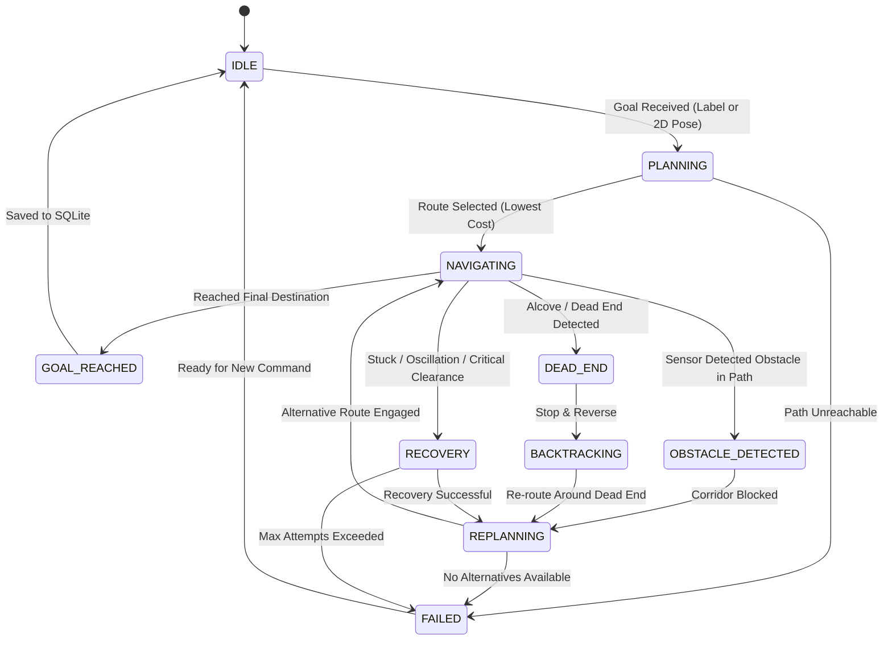

# Autonomous Navigation Intelligence V2

This document details the advanced path planning, route cost evaluation, candidate alternative routing, dead-end intelligence, and recovery behaviors in **Autonomous Navigation V2**.

---

## 1. Navigation State Machine

The robot operates under a 10-state deterministic state machine managed by [`DecisionEngineNode`](file:///home/soham-darade/CV_Autonomous_Navigation/ros2_ws/src/autonomous_robot_navigation/autonomous_robot_navigation/decision_engine_node.py):



### State Definitions
1. **`IDLE`**: Ready and awaiting goal commands from the web dashboard or RViz.
2. **`PLANNING`**: Computing K-shortest paths and scoring candidate routes via multi-criteria weights.
3. **`NAVIGATING`**: Actively traversing topological corridors via Nav2 action client.
4. **`OBSTACLE_DETECTED`**: Dynamic obstacle identified within critical corridor range ($d < 2.2\text{m}$).
5. **`REPLANNING`**: Corridor marked obstructed; computing bypass around blocked edge.
6. **`DEAD_END`**: Known dead end or pocket detected ahead; robot halted safely.
7. **`BACKTRACKING`**: Safely reversing away from the dead end ($v_x = -0.18\text{m/s}$).
8. **`RECOVERY`**: Executing multi-step recovery maneuver (stop, reverse 1.5m, reorient 45°, replan).
9. **`GOAL_REACHED`**: Destination reached; metrics written to persistent SQLite memory.
10. **`FAILED`**: Path unreachable or max recovery attempts exceeded.

---

## 2. Multi-Criteria Route Cost Function

Rather than blindly selecting the shortest Euclidean distance, V2 evaluates routes using a weighted multi-criteria cost function:

$$\text{Route Cost} = \sum_{e \in \text{Path}} \Big[ w_{\text{dist}} \cdot D_e + w_{\text{obs}} \cdot \Omega_e + w_{\text{hist}} \cdot F_e + w_{\text{cong}} \cdot C_e + w_{\text{turn}} \cdot T_e + w_{\text{narrow}} \cdot N_e + w_{\text{time}} \cdot \tau_e \Big]$$

Where:
* $D_e$: Corridor Euclidean distance (meters)
* $\Omega_e$: Obstacle density factor based on dynamic perception
* $F_e$: Historical failure penalty ($1.0 - \text{ReliabilityScore}$)
* $C_e$: Traversal congestion factor
* $T_e$: Turn count penalty along the edge
* $N_e$: Narrow corridor penalty (1 if corridor width $< 1.2\text{m}$, else 0)
* $\tau_e$: Previous moving average travel duration (seconds)

### Example Route Comparison
* **Route A (East Bypass)**: Distance = 22.4 m, Open corridor, Low obstacle history $\rightarrow$ **Cost = 34.2**
* **Route B (Direct Central Spine)**: Distance = 16.8 m, Very narrow, Frequent dynamic cart blockage $\rightarrow$ **Cost = 68.5**
* **Decision**: Planner automatically selects **Route A** because its multi-criteria cost is significantly lower, avoiding predictable delays and collisions.

---

## 3. Configuration File (`navigation_v2.yaml`)

Configuration file: [`config/navigation_v2.yaml`](file:///home/soham-darade/CV_Autonomous_Navigation/config/navigation_v2.yaml)

```yaml
navigation:
  max_speed: 0.50
  min_speed: 0.05
  safe_distance: 0.45
  critical_distance: 0.28
  goal_tolerance: 0.35
  node_arrival_distance: 0.85
  replanning_distance: 2.2
  stuck_timeout: 5.0
  backtrack_distance: 0.8
  reverse_speed: 0.18

route_cost_weights:
  distance_weight: 1.0
  obstacle_weight: 3.5
  history_failure_weight: 5.0
  congestion_weight: 2.0
  turn_penalty_weight: 0.8
  narrow_corridor_penalty: 2.5
  travel_time_weight: 0.5
  dead_end_penalty: 10000.0
  blocked_edge_penalty: 100000.0

recovery:
  max_recovery_attempts: 3
  reorient_angle_rad: 0.785
  reverse_duration_sec: 2.5
  min_clearance_recovery_threshold: 0.25
```

---

## 4. Candidate Alternative Routes (K-Shortest Paths)

When planning a mission or handling a dynamic blockage, [`TopologicalGraph.find_alternative_routes()`](file:///home/soham-darade/CV_Autonomous_Navigation/ros2_ws/src/autonomous_robot_navigation/autonomous_robot_navigation/topological_graph.py) generates up to $K=3$ distinct topological routes using iterative edge penalization.

Each candidate route contains:
* `route_id`: Option label (`Route A`, `Route B`, `Route C`)
* `distance`: Cumulative distance in meters
* `estimated_time`: ETA in seconds at nominal cruising speed
* `total_cost`: Evaluated multi-criteria cost
* `obstacle_density`: Average obstacle encounter probability
* `reliability_pct`: Historical success percentage from SQLite
* `cost_breakdown`: Itemized score components

The candidate alternatives are published in real time on `/navigation/alternative_paths` and rendered interactively on the Web Dashboard.

---

## 5. Dead-End Intelligence & Backtracking Safety

When the robot detects an alcove, dead end, or cul-de-sac:
1. **Stop Safely**: Sends zero velocity to `/cmd_vel` and cancels active Nav2 action goals.
2. **Record Coordinates**: Stores metric $(x, y)$ in the SQLite `dead_ends` table with timestamp.
3. **Penalize Corridor**: Sets `is_dead_end = 1` on the connecting edge, applying a $+10,000$ cost penalty.
4. **Safe Backtracking with Rear LiDAR Verification (V2.1)**:
   - Continuously evaluates rear LiDAR sector ($|\theta| \ge 135^\circ$).
   - If rear clearance $< 0.35\text{m}$, reverse motion is immediately aborted, and a safe $+45^\circ$ pivot turn is executed.
   - If clear, commands backward motion ($v_x = -0.18\text{m/s}$) for 2.0 seconds, halting instantly if clearance drops $< 0.30\text{m}$.
5. **Replan Route**: Re-computes an optimal alternative route to the destination excluding the dead end.

---

## 6. Robust Recovery System

The recovery system monitors four trigger conditions:
1. **Stuck / No Progress**: Robot translation $< 0.10\text{m}$ over `stuck_timeout` (5.0s) while actively navigating.
2. **Critical Forward Clearance**: Forward LiDAR sector clearance $< 0.25\text{m}$ or absolute minimum $< 0.16\text{m}$ (preventing false alarms when navigating through doorways or alongside walls).
3. **Nav2 Abort / Goal Rejected**: Nav2 action server reports `STATUS_ABORTED` or action server is temporarily busy during asynchronous cancellation.
4. **Transient Obstacle Cooldown (V2.1)**: A 5.0-second cooldown is enforced on dynamic corridor obstacle callbacks to prevent infinite replan loops.

### Recovery Sequence
1. Stop linear and angular motion immediately.
2. Cancel Nav2 goal and wait 0.5s for action server cancellation to settle cleanly.
3. Log recovery event with metric coordinates and minimum clearance into SQLite `recovery_events`.
4. Backtrack / reverse safely away from the obstruction (subject to rear LiDAR clearance check).
5. Re-orient robot heading slightly ($+45^\circ$).
6. Re-engage navigation along an alternative corridor, with automatic fallback allowing passage through penalized edges if no physical bypass exists.
