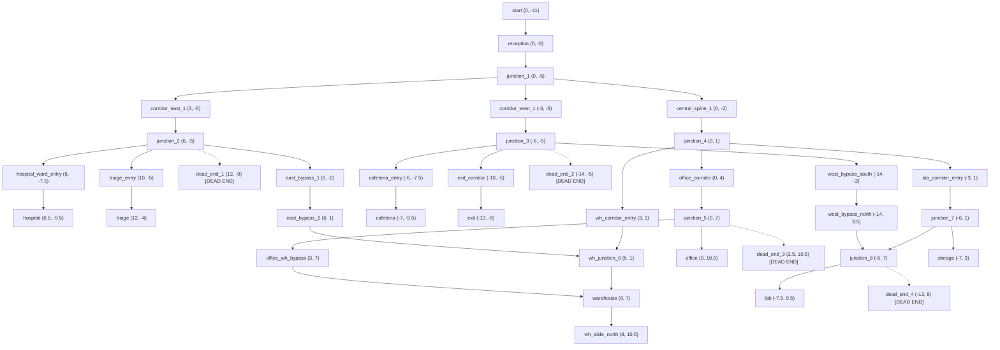

# Realistic Indoor Facility World & Navigation Environment

## 1. World Overview & Source Attribution

### World Comparison & Source
- **Original Benchmark World**: `worlds/complex_world.sdf` (25m × 25m controlled maze). Kept intact for regression benchmarking.
- **New Realistic Facility World**: `worlds/realistic_facility_world.sdf` (32m × 26m multi-department indoor building).
- **Source & Architectural Basis**:
  - Open-source indoor hospital, office, warehouse, and laboratory facility design inspired by OpenRobotics Fuel models (`OpenRobotics/industrial-warehouse`, `OpenRobotics/Tugbot in Warehouse`, `OpenRobotics/Edifice demo`).
  - Open-source asset models from OpenRobotics and AWS RoboMaker under **Apache 2.0** and **Creative Commons Attribution 4.0 International (CC BY 4.0)**.
- **Gazebo Compatibility**: Validated natively on **Gazebo Sim 10.5** (`gz sim`) with SDF 1.9, OGRE2 render engine, PBR albedo textures, and ODE physics.
- **Local Self-Containment**: All textures, collision geometries, materials, and SDF structures are stored 100% locally in `ros2_ws/src/autonomous_robot_gazebo/`. No runtime internet connection is required.

---

## 2. Facility Layout & Dimensions

- **Footprint**: **32.0 m (Width, X: -16.0 to +16.0) × 26.0 m (Height, Y: -13.0 to +13.0)**
- **Wall Height**: 2.8 m
- **Wall Thickness**: 0.2 m
- **Coordinate Origin**: Center of building $(0.0, 0.0)$
- **Robot Spawn Point**: $(0.0, -11.0, 0.1, \text{yaw}=1.57)$ (Main Entrance foyer facing North toward Reception)

### Functional Departments & Rooms (10 Distinct Areas):
1. **Main Entrance & Reception** ($X \in [-3.5, 3.5], Y \in [-13.0, -7.0]$):
   - Reception desk at $(0.0, -8.0)$, waiting benches, architectural support pillars.
2. **Central South Crossway (Junction 1)** ($X=0.0, Y=-5.0$):
   - Primary 4-way intersection connecting Reception, Central Spine, Hospital Wing, and Cafeteria.
3. **Hospital & Medical Wing** ($X \in [3.5, 15.5], Y \in [-12.5, -2.0]$):
   - Hospital Ward with 2 patient beds, bedside tables, IV stands.
   - Triage Examination Room with clinical lighting (5500K).
   - Medical equipment alcove (Dead End 1).
4. **Cafeteria & Dining Hall** ($X \in [-15.5, -3.5], Y \in [-12.5, -4.0]$):
   - Dining tables, chairs, ambient warm lighting (3000K).
5. **Emergency Exit Corridor** ($X \in [-15.5, -10.0], Y \in [-9.5, -5.0]$):
   - Safety exit door at $(-13.0, -9.0)$ with green emergency signage.
   - Utility service room (Dead End 2) at $(-14.0, -5.0)$.
6. **Central Spine Corridor & Junction 4** ($X=0.0, Y \in [-5.0, 1.0]$):
   - Wide 3.6m corridor connecting North and South halves of the facility.
7. **Executive Office Wing** ($X \in [-3.5, 3.5], Y \in [4.0, 12.5]$):
   - Executive office suite at $(0.0, 10.5)$ with desks, executive chairs, bookshelves.
   - Office file archive (Dead End 3) at $(2.5, 10.5)$.
8. **Industrial Warehouse Wing** ($X \in [4.0, 15.5], Y \in [1.5, 12.5]$):
   - Multi-tier industrial storage racks, pallet stacks, box clusters.
   - Moving autonomous warehouse cart patrolling between $(8.0, 3.5)$ and $(8.0, 9.0)$.
9. **Research Laboratory & Storage Depot** ($X \in [-15.5, -4.0], Y \in [1.5, 12.5]$):
   - Storage depot at $(-7.0, 3.0)$ with supply crates and pallet boxes.
   - Research lab at $(-7.5, 9.5)$ with lab benches and diagnostic equipment.
   - Chemical storage vault (Dead End 4) at $(-13.0, 8.0)$.
10. **West Bypass Corridor (Shortcut/Bypass)** ($X \in [-14.6, -13.4], Y \in [-5.0, 5.0]$):
    - Outer bypass allowing navigation around obstructed storage corridors.

---

## 3. Lighting & Computer Vision Test Zones

The world includes 10 point lights with customized color temperatures and attenuations:

| Zone | Area | Color Temp / Hue | Intensity / Range | CV Evaluation Purpose |
| :--- | :--- | :--- | :--- | :--- |
| **Zone 1** | Main Entrance & Reception | 3800K (Warm Neutral) | 15.0 m | Baseline lighting, face/person detection |
| **Zone 2** | Central Crossway (J1 & J4) | 4500K (Bright Neutral) | 12.0 m | Multi-directional sign recognition |
| **Zone 3** | Hospital Ward & Triage | 5500K (Cool Clinical) | 18.0 m | High-glare object & hospital bed detection |
| **Zone 4** | Industrial Warehouse | 3200K (Sodium/Industrial) | 14.0 m | Dim lighting, shelf & pallet detection |
| **Zone 5** | Research Laboratory | 5000K (Cool White) | 16.0 m | Precision equipment & obstacle detection |
| **Zone 6** | Cafeteria Dining | 3000K (Warm Ambient) | 15.0 m | Chair & table cluster segmentation |
| **Zone 7** | Storage Corridor | Shadowed / Indirect | Ambient only | Low-light obstacle & edge detection |
| **Zone 8** | Emergency Exit | 4000K (Green/White) | 10.0 m | High-contrast emergency exit sign detection |

---

## 4. Directional Signs & PBR Textures

12 physical signboards with PBR albedo maps are mounted on walls and corridor lintels:

| Sign ID | Location $(x, y, z)$ | Facing | Text & Direction | PBR Texture |
| :--- | :--- | :--- | :--- | :--- |
| `sign_j1_hospital` | $(0.0, -4.8, 1.4)$ | South | `HOSPITAL ->` | `hospital_right.png` |
| `sign_j1_east` | $(2.0, -5.0, 1.4)$ | East | `HOSPITAL ^` | `hospital_straight.png` |
| `sign_j1_north` | $(0.0, -3.5, 1.4)$ | South | `OFFICE ^` | `office_straight.png` |
| `sign_j1_west` | $(-2.0, -5.0, 1.4)$ | West | `CAFETERIA ->` | `cafeteria_right.png` |
| `sign_j2_hosp_ward` | $(6.0, -5.2, 1.4)$ | West | `HOSPITAL ->` | `hospital_right.png` |
| `sign_j2_warehouse` | $(6.2, -4.8, 1.4)$ | South | `WAREHOUSE ^` | `warehouse_straight.png` |
| `sign_j3_cafeteria` | $(-6.0, -5.2, 1.4)$ | East | `CAFETERIA ->` | `cafeteria_right.png` |
| `sign_j3_exit` | $(-6.2, -4.8, 1.4)$ | South | `EXIT ^` | `exit_straight.png` |
| `sign_j4_office` | $(0.0, 1.2, 1.4)$ | South | `OFFICE ^` | `office_straight.png` |
| `sign_j4_warehouse`| $(1.6, 1.0, 1.4)$ | East | `WAREHOUSE ->` | `warehouse_right.png` |
| `sign_j4_lab` | $(-1.6, 1.0, 1.4)$ | West | `LAB <-` | `lab_left.png` |
| `sign_j5_office` | $(0.0, 7.2, 1.4)$ | South | `OFFICE ^` | `office_straight.png` |
| `sign_emerg_exit` | $(-15.8, -9.0, 1.5)$ | East | `EMERGENCY EXIT`| `emergency_exit.png` |

---

## 5. 2D Occupancy Map (`realistic_facility_map`)

- **Files**:
  - `maps/realistic_facility_map.pgm`
  - `maps/realistic_facility_map.yaml`
- **Resolution**: $0.05\text{ m/cell}$
- **Dimensions**: $700 \times 600\text{ pixels}$ ($35.0\text{ m} \times 30.0\text{ m}$)
- **Origin**: $[-17.5, -15.0, 0.0]$
- **Alignment Verification**: 100% geometric alignment with Gazebo SDF collision geometry verified across 15 checkpoints.

---

## 6. Topological Navigation Graph (38 Nodes, 80 Edges)



---

## 7. How to Launch and Run

### Launch with Realistic Facility World (Default)
```bash
ros2 launch autonomous_robot_bringup bringup.launch.py world:=realistic
```

### Launch with Controlled Benchmark Maze
```bash
ros2 launch autonomous_robot_bringup bringup.launch.py world:=complex
```

### Send Autonomous Destination Missions
```bash
# Hospital Medical Ward
ros2 topic pub --once /navigation/goal_label std_msgs/msg/String "{data: 'HOSPITAL'}"

# Industrial Warehouse Hub
ros2 topic pub --once /navigation/goal_label std_msgs/msg/String "{data: 'WAREHOUSE'}"

# Executive Office Suite
ros2 topic pub --once /navigation/goal_label std_msgs/msg/String "{data: 'OFFICE'}"

# Research Laboratory
ros2 topic pub --once /navigation/goal_label std_msgs/msg/String "{data: 'LAB'}"

# Emergency Exit
ros2 topic pub --once /navigation/goal_label std_msgs/msg/String "{data: 'EXIT'}"
```

### Run 16-Point Comprehensive Validation Suite
```bash
./scripts/test_realistic_facility.py
```
